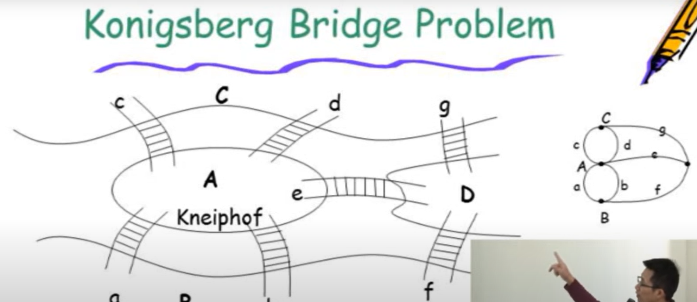
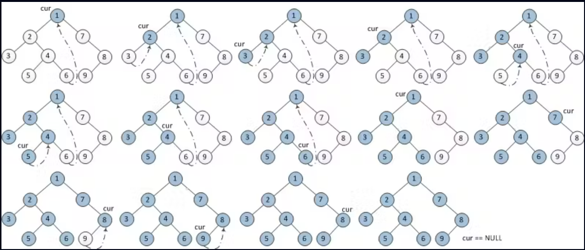

# Graph

若每個路徑僅能走一次，需要偶數個degree才能達成

## graph組成:

### vertext
圖的節點

### edge
圖的連線，可以有方向性也可無
## graph分類:

### 有方向性:directed graph
edge表示方式:

### 無方向性:undirected graph

edge表示方式:

## graph限制

### 不會有vertex指回自己(v,v)

### 不會有相同指向的edge，若有稱multigraph

## terminlogy of graph

### adjacent
相鄰

### simple path
一條路徑中，起點與終點可以為同一個點，但其他頂點皆為不相同的點，不可重複出現

###　Acyclic graph(DAG)
directed graph中，不會有cycle的圖 

### connected graph
每個vertex都有路徑可以連到其他vertex，**沒有孤立的vertex**
### strongly connected graph
**directed graph**中，任意兩頂點**彼此之間存在路徑**可以互通，如下圖，A點可以到B或C點，B點可以到A或C點，C點也可以到A或B點
### complete graph
每個vertex都有edge連到其他vertex
#### 連接數量
##### directed graph
n(n-1)
##### undirected graph
n(n-1)/2
### sub graph
graph中的一部分

1,2,3,4皆為下圖的sub graph
