# Graph
>重點摘要
>
>graph表示方式有四種
>

若每個路徑僅能走一次，需要偶數個degree才能達成

## graph組成:

### vertext
圖的節點

### edge
圖的連線，可以有方向性也可無
## graph分類:

### 有方向性:directed graph
edge表示方式:

### 無方向性:undirected graph

edge表示方式:

## graph限制

### 不會有vertex指回自己(v,v)

### 不會有相同指向的edge，若有稱multigraph

## terminlogy of graph

### adjacent
兩個vertex之間有edge連接，相鄰

### simple path
一條路徑中，起點與終點可以為同一個點，但其他頂點皆為不相同的點，不可重複出現

### Acyclic graph(DAG)
directed graph中，不會有cycle的圖 

### connected graph
每個vertex都有路徑可以連到其他vertex，**沒有孤立的vertex**

### strongly connected graph
**directed graph**中，任意兩頂點**彼此之間存在路徑**可以互通，有一條路徑可以連到其他vertex

### complete graph
每個vertex都有edge連到其他vertex
#### edge數量
1. directed graph
n(n-1)
2. undirected graph
n(n-1)/2
### sub graph
graph中的一部分
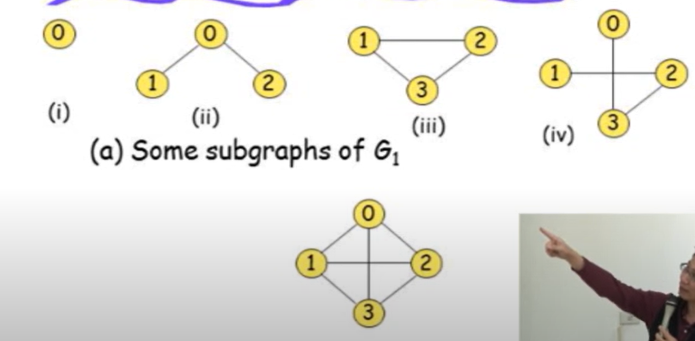
1,2,3,4皆為下圖的sub graph

## 程式表示graph

### array 
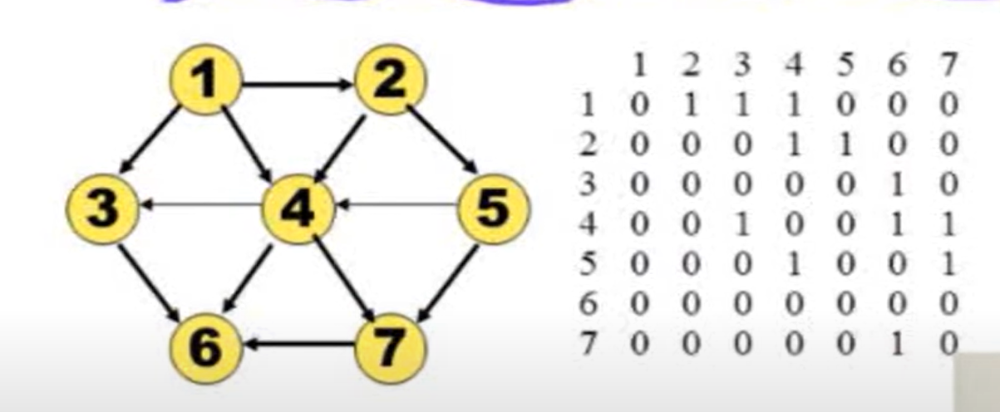
#### 問題:
稀疏矩陣，浪費空間
space complexity:O(V^2)
若是undirected graph，symmetric matrix

### adjacency list
紀錄所有vertex的edge
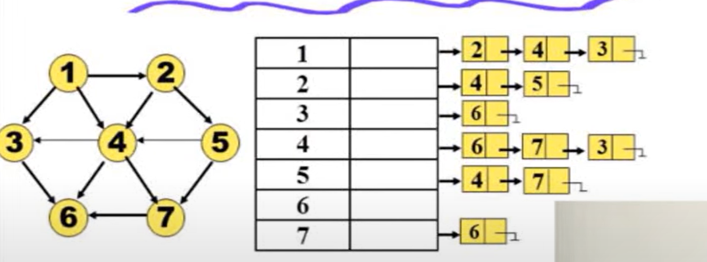
#### 優點:
space complexity:O(V+E)，vertex數量+edge數量
**good for sparse**

### inverse adjacency list
與adjacency list相反，紀錄in-degree(指向該vertex的edge)

#### 為甚麼需要
使用adjacency list時，若要找in-degree，需要遍歷整個list

### one dimension array
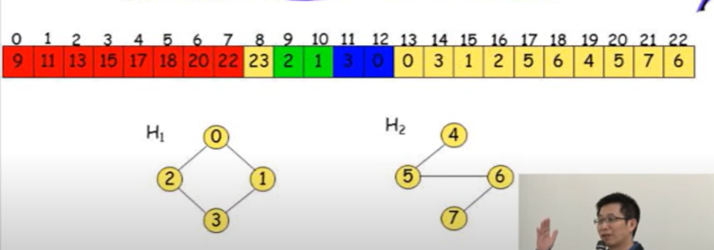
紀錄每個vertex的edge起始位置
ex:
1. vertex0指向9，9為起始位置，9開始存放vertex0的edge
2. vertex1指向11，11為起始位置，11開始存放vertex1的edge
#### 缺點:
刪除新增vertex時，需要shift整個array

### multilists
在undirected graph中，使用adjacency list，則每個edge會被記錄兩次
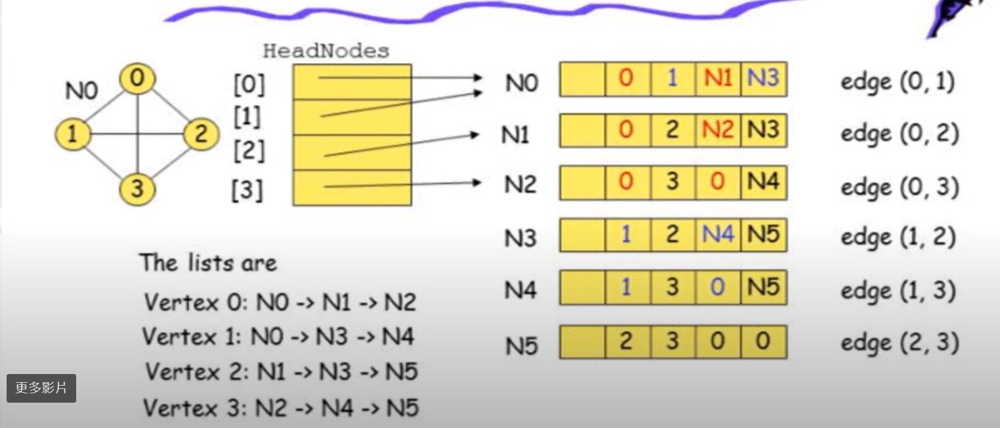
以edge base，紀錄每個edge的起始點與終點
上方例子中有五個欄位
1. 第二個欄位為edge的起點
2. 第三個欄位為edge的終點
3. 第四個欄位為和第二個欄位有關的edge的pointer
4. 第五個欄位為和第三個欄位有關的edge的pointer
#### node數量為edge數量
>注意 adjacency list 與adjacency multilist的差別
## weighted edges
### Network
若edge有weight，稱nework

>**補充:**
> 1. google map中，整個map為一graph
> 2. 每個路口為vertext，每條路有單行雙行，為edge，因此是directed graph
> 3. 道路cost為距離
> 4. 找出路徑就是shortest path問題

## graph operation
### DFS
深度優先搜尋
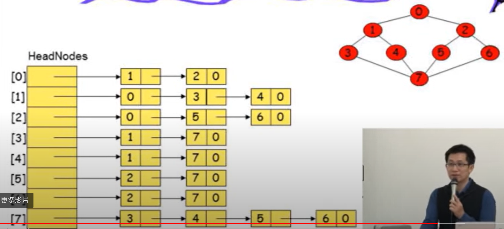
由adjacency list中的第一個edge開始走，走到沒看過的vertext，跳去該vertext
因此該範例的traversal順序為0,1,3,7,4,5,2,6
不唯一，只要adjacency list中的edge順序不同，traversal順序就會不同
#### analysis DFS
1. 若是adjacency list
time complexity:O(e)
2. 若是adjacency matrix
time complexity:O(n^2)
#### 程式實現traversal
1. 使用stack
2. 使用recursive
### BFS
廣度優先搜尋
level order traversal
#### 程式實現traversal
1. 使用queue
2. 使用recursive
## spanning tree
spanning tree:為一graph的sub graph，且頂點一樣，使用最小的edge數量連接所有vertex

### minimum cost spanning tree(MCST)
找出spanning tree中，edge的cost或weight總和最小的spanning tree，稱為minimum cost spanning tree
> 定義 : is a spanning tree of least cost
#### edge數量
n-1
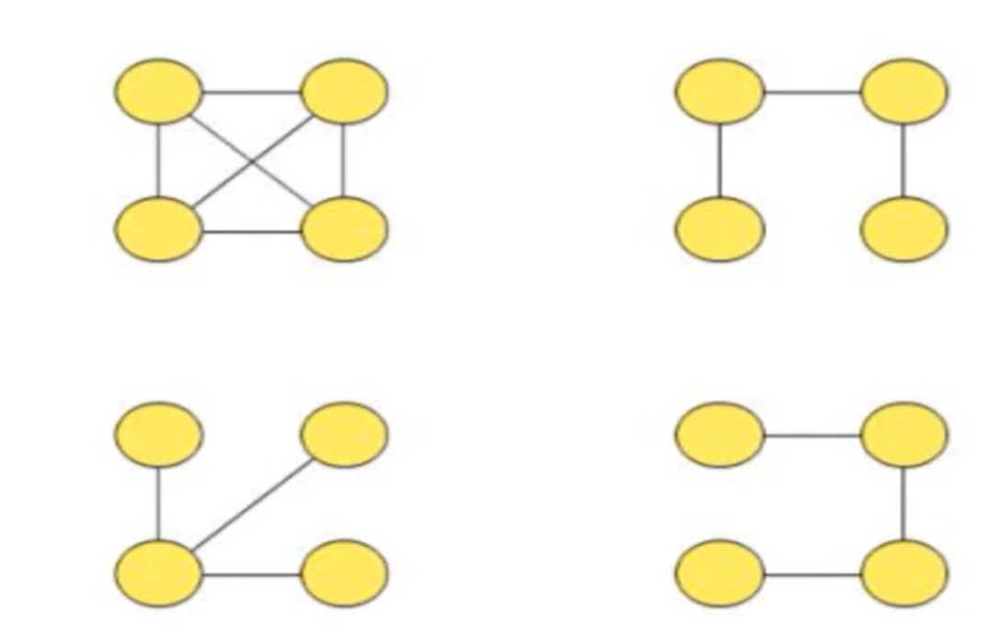
###DFS與BFS spanning tree
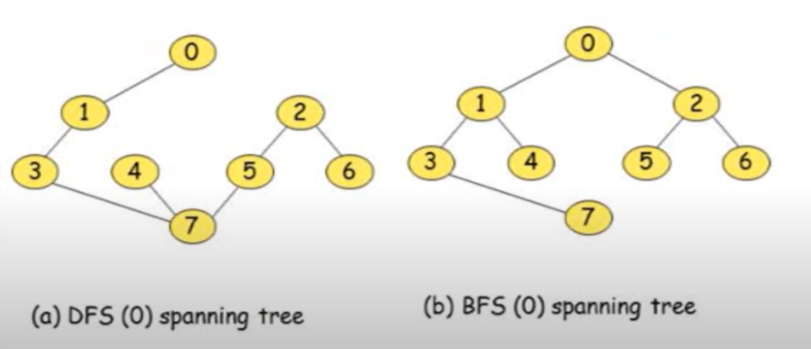

#### greedy algorithm
greedy algorithm不一定能找出最佳解，不保證為optimal。

##### Kruskal's algorithm
**以edge為出發點**
1. 每次找出最小的edge
2. 不要形成cycle
ex:

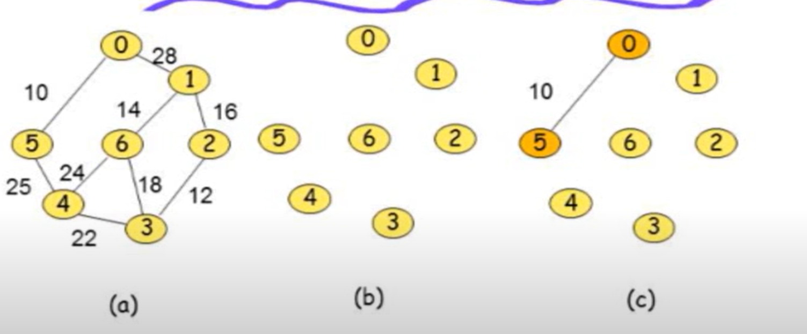

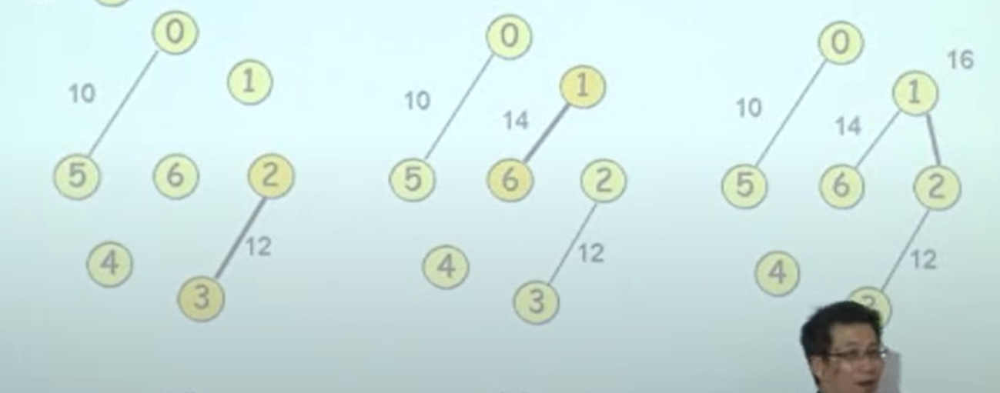

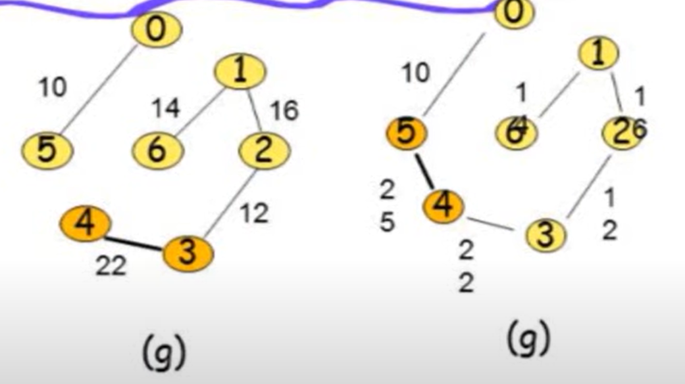

##### Prim's algorithm
**以vertex為出發點**
1. 先選一個最小的edge，得到兩個vertex
2. 由這兩個vertex找出最小的edge
3. 重複步驟2，直到所有vertex都被選到
4. 不要形成cycle

> implement:priority queue
> 💡如何detect cycle?
##### Sollin's algorithm
**結合Prim's與Kruskal's，以頂點出發，選邊**
1. 由1~6的vertex找出最小的edge，連起來
2. 若該vertex的最小edge已經被選過，則跳過(如vertex3,vertex5,vertex6)
3. 看連完後的所有vertex，找出可連接的最小edge

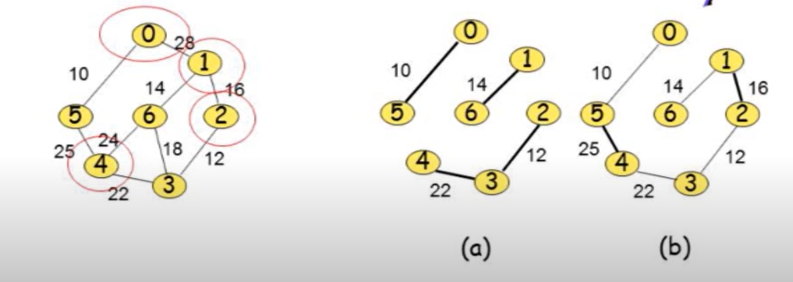

## biconnected component
在一個connected graph中，若刪除一個vertex，graph仍然是connected，則稱為biconnected component，即沒有任何articulation point
### articulation point
若刪除該vertex，則graph會被分成兩個connected component
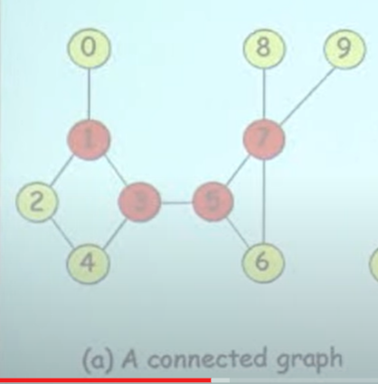
紅色點為articulation point
### 使用DFS找出bioconnected component
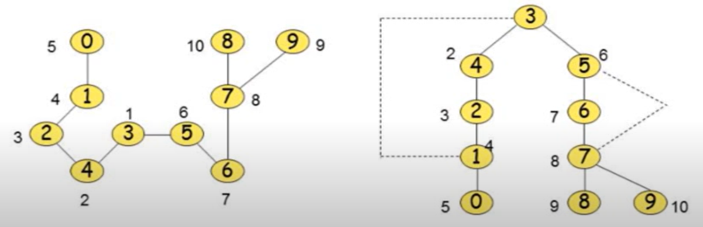
右圖為DFS以3為起點，所構成的spinning tree
虛線意思為原本graph有的edge
#### back edge
在spinning tree中，若有edge連接到ancestor，則稱為back edge
#### low(w)
將geaph變為spinning tree後，以
w為root，以w為起點，透過**他的child**找出的最小的dfn值
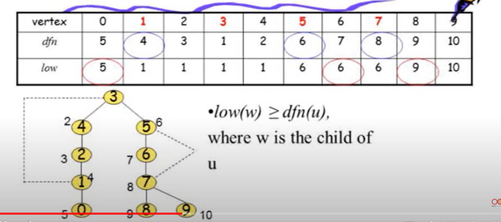
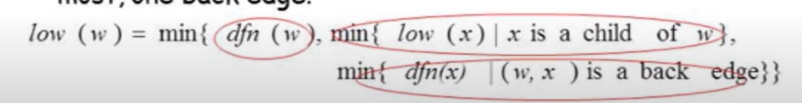

**dfn為在traersal時的順序**
#### 如何找出articulation point
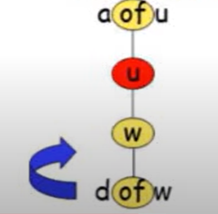
計算low值，若low值大於等於dfn值，則為articulation point，**因為沒有其他low低於該點**，因此刪除該點，graph會被分成兩個connected component
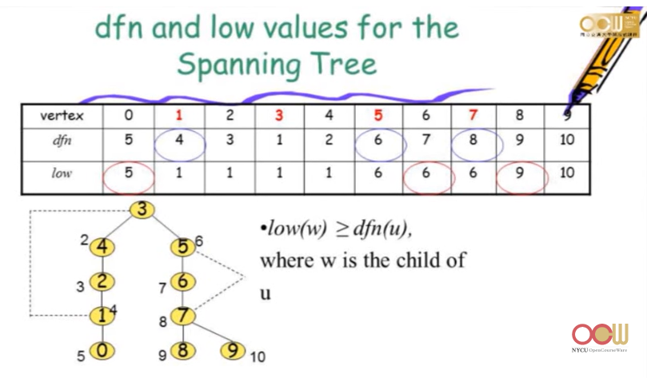
**總結步驟:**
1. 使用DFS traversal，決定dfn值
2. 紀錄back edge
3. 決定low值(實際由tree最下面先算)
4. 判斷low值是否大於等於dfn值
5. 若是，則為articulation point
> 1. 若算出articulation point，如何分辨bioconnected component?
> 2. 如何找 maxinum biconnected component?
## shortest path

### dijkstra's algorithm
**greedy algorithm**
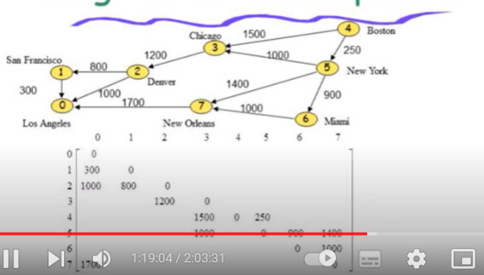

1. Initial:從4出發，紀錄可以到達的vertex距離
2. 第一輪:選最小距離的vertex，紀錄新的距離，若有更小的距離，則更新數值
3. 第二輪:繼續選cost最小的vertex，輪迴直到抵達終點
#### 限制
為什麼不是optimal?
> 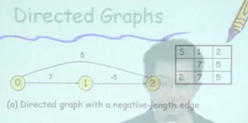
> 若是有**負數的edge**，則無法使用dijkstra's algorithm
> 若是**存在cycle**，則無法使用dijkstra's algorithm
### Bellman-Ford algorithm
**optimal algorithm**
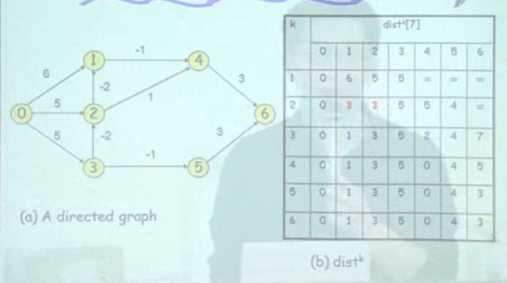
1. 回合一:k=1，只能走一步時到其他vertex的cost
2. 回合二:k=2，走兩步時到其他vertex的cost
3. 若新的cost小於原本的cost，則更新
> 記下前一個回合部分，沒懂
### all pair shortest path
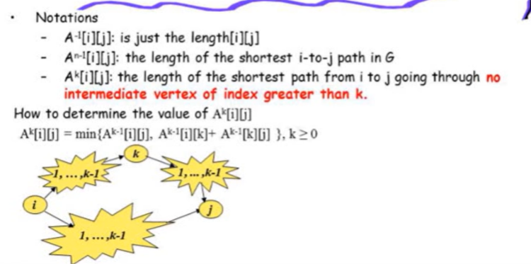
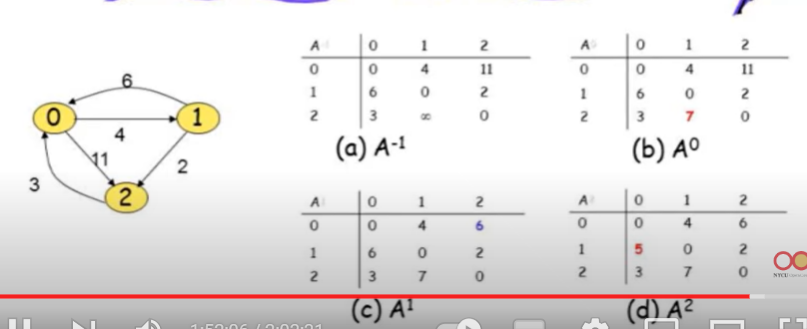
最多會有n-1個round
A^n為可經過n個vertex的cost
## AOV network
vetex表示activity
Activity on vertex network
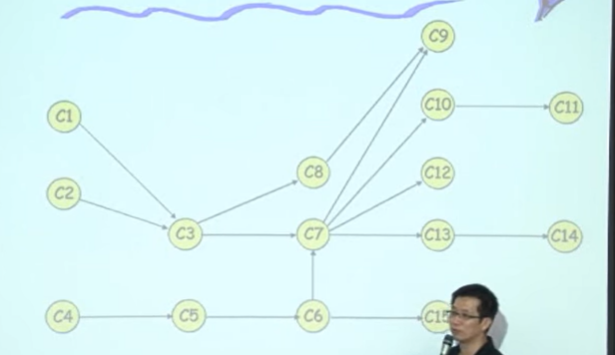
1. 以vertex表示activity
### topological order
將AOV network排序為一個sequence

在一個AOV network中，若有一個Vertex沒有其他vertex指入(in-degree=0)，則可被output，依照這個規則，可以列出topological order
### 使用adjacency list inplement
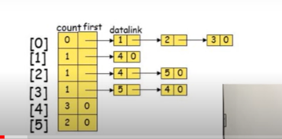
加入count，紀錄in-degree
作法:找出目前count=0的vertex，將該list中的vertex的count-1
### 使用inverse adjacency list inplement

## AOE network
Activity on edge network
edge表示activity
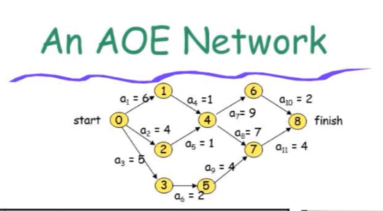
### 使用adjacency list inplement
多一個欄位，紀錄duration
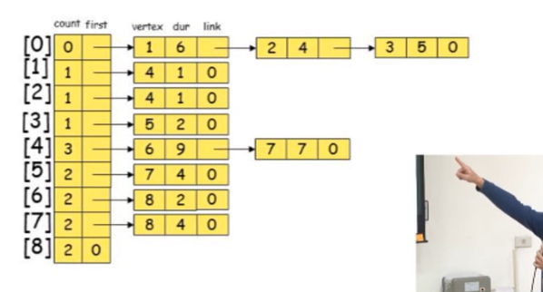
在程式中做ee
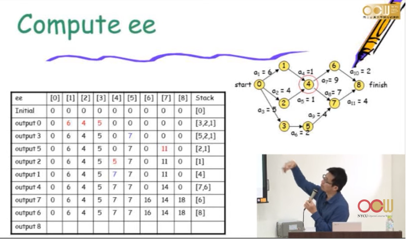
1.initial:找出in-degree=0的vertex，並將其ee設為0
2.將該vertex push進stack
3.將該vertex的out degree-1
4.新回合:若該vertex的out degree=0，則pop出stack，並將該vertex的ee設為max(ee)+duration
LF:latest finish time
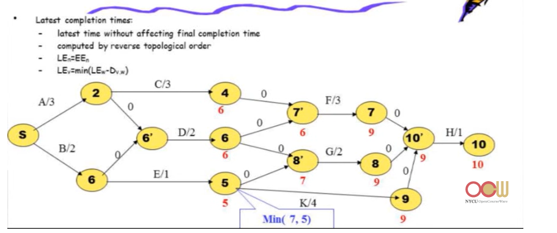
**選最小值**
### critical path
LE-EE=0(early start time=late start time)
> 1. 如何找出critical path?
> critical path是否會斷掉?

