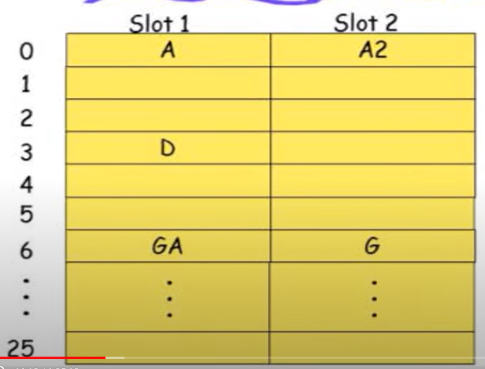

 Hash
===

>💡 **Hashing重點**
>
>**hash** 
>
> 三個hash function
>
> **狀況**:collision，overflow
>
> **overflow解法**:chaining，openaddress
>
>static hash
>
>dynamic hash
>
>trie
>
>trie問題:traverse時間
>
>解法:建目錄，directory 

## hash基本架構
### hsah種類
#### Static hashing

hash function 相同

#### Dynamic hashing

動態調整hash function ex:資料庫search

### hash table名詞解釋

#### identifier density

共n筆資料，有T個identifiers則identifier density為n/T

#### loading density

有s個bucket，一個bucket可以放個資料，現有n個資料loading density=n/(sb) 
### hash 現象

#### Collision

當兩個hash後結果相同，即collision。

#### Overflow

當busket已滿，再有資料進入即overflow。  

example:

hash function:依據英文數字

bucket:26

每個bucket只能放2資料
### 理想 Hash function

1. 簡單計算
2. collision最小化
3. 能平均分配資料到buckets

## Hash function

**hashfunction效率通常取決於如何處理overflow，即hash function。**

#### dynamic hash function
**Dynamic hashong**

##### trie

由表中後往前建立tire，黃色是bucket，一個bucket放兩個資料，超過則split，split會調整其他資料

hash function為動態，隨資料而增減，

tire會有access time的問題

會有skeled問題(歪斜樹)

---

##### extemdable hash

概念一樣，不需要traverse的方法，建立一個目錄

##### hashing  with directory

不使用pointer 直接紀錄menory address

#### static hash function

常見 static hash function

滿足以上可稱uniform hash function

##### Mid-square function

抓中間的數字，平方

##### Division

使用division table大小不要是2的次方數

##### fold

###### shift folding

將資料三個三個切，加總所有分段，

###### folding at boundaries

使用對折的方式，每三個切後對折，最後加總。

##### mod

---

## overflow handling

### open addressing

開放其他空間(bucket)用

搜索:往附近找

#### collision resolution strategy
**在open addressing條件下，該放在哪個bucket**

##### linear probing
**一個linear function決定**

i=0;取mod10，若新找到的bucket也滿了，i+=1，hash值+i再做一次

primary clustering→該方式會有資料聚集現像，且會花費多次找新bucket

##### quadratic probing

**和linear probing差別在於使用i平方**

##### double hashing
**再用另一個function hash一次**

有多個hash function，一個不行換下一個。

### chaining ex:使用list存，可無限加。

Average search length:計算該需搜尋幾次

