# List
## Insertion

重新assign FAT的next node 
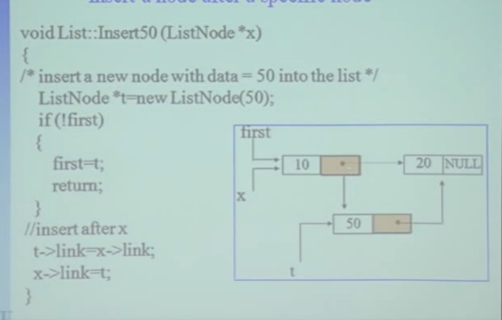

## Deletion
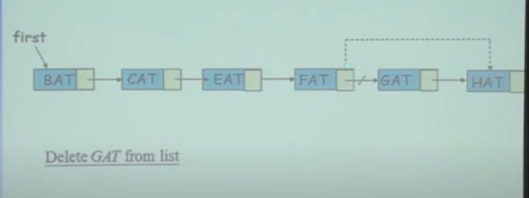
1. 檢查是否為GAT
2. FAT的next node重新assign
缺點: 需要從頭開始找，使用array可以直接找到index，在搜尋上比較快
>由leetcode 發現技巧，使用兩個pointer，一個指向前一個node，一個指向當前node，這樣可以在O(1)時間內刪除node

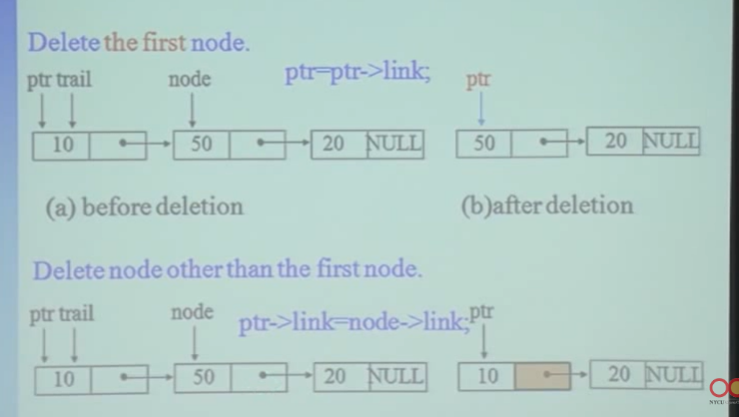

## attach
從頭開始找，找到最後一個node，將最後一個node的next指向新的node
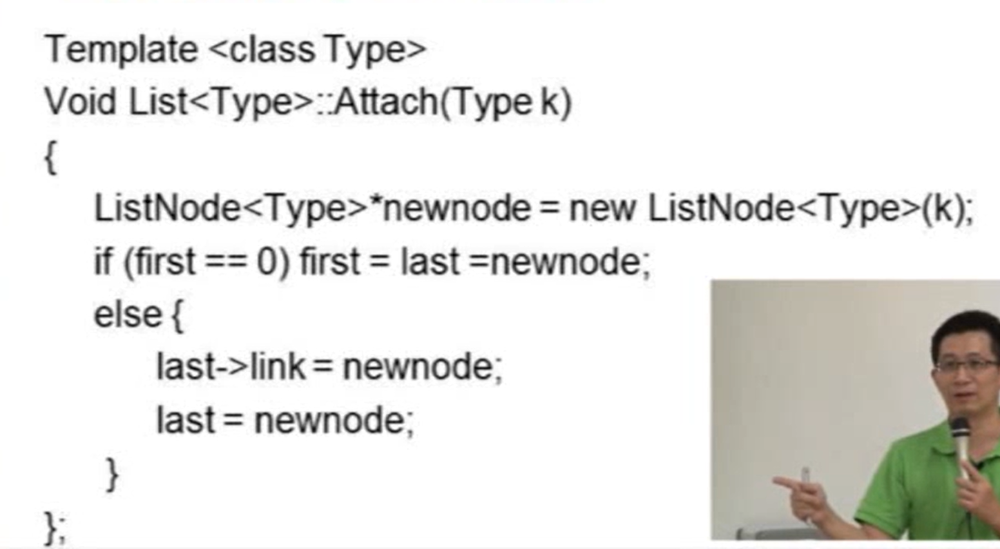

## inverse
會需要三個pointer，一個指向前一個node，一個指向當前node，一個指向下一個node，由頭開始改變node指向
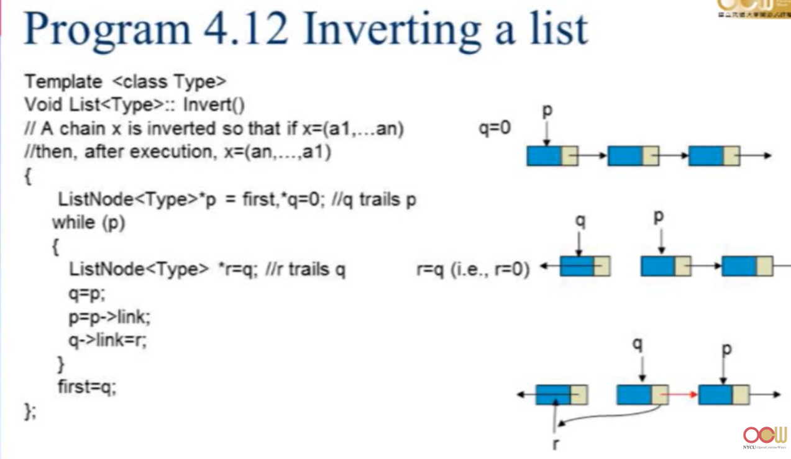

## connecting two list
走到第一個list的最後一個node，將最後一個node的next指向第二個list的第一個node
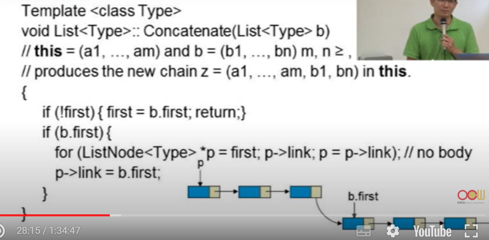

## code
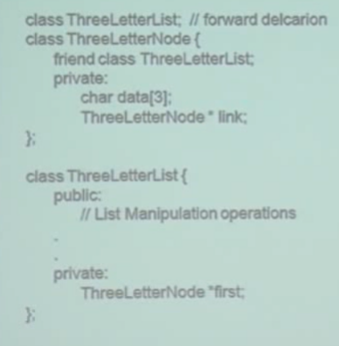
### Pinter 操作
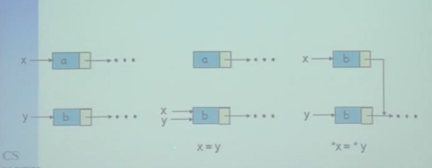
1. x=y會將y所指的記憶體位置指給x，x所指的記憶體位置會被釋放。
2. *x=*y，將y所指的記憶體位置內的值指給x所指的記憶體位置。x和y所指的記憶體位置不會改變。但內容會是一樣的。
## circular list
需要記得first
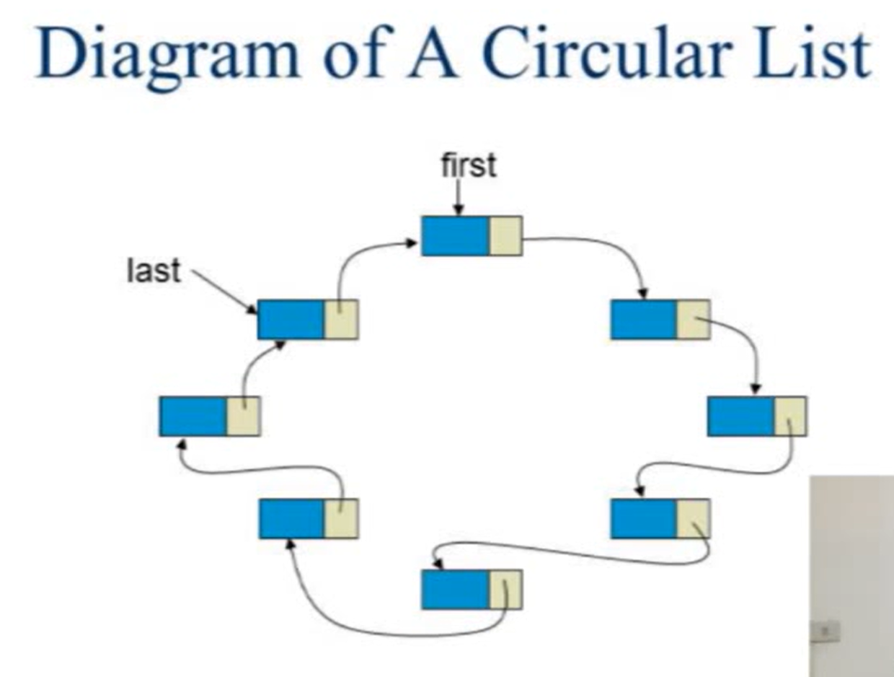

## linked list stack queue
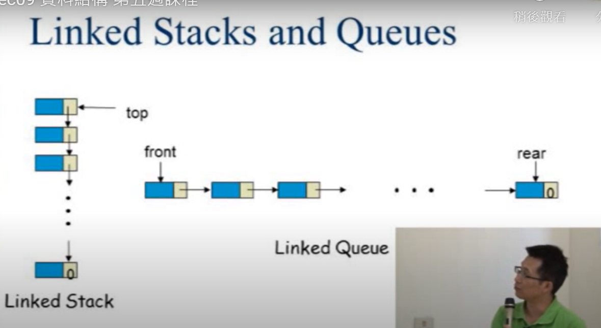

## 多項式
一個欄位記錄係數，一個欄位記錄次方
優點:資料sparse時，可以節省記憶體
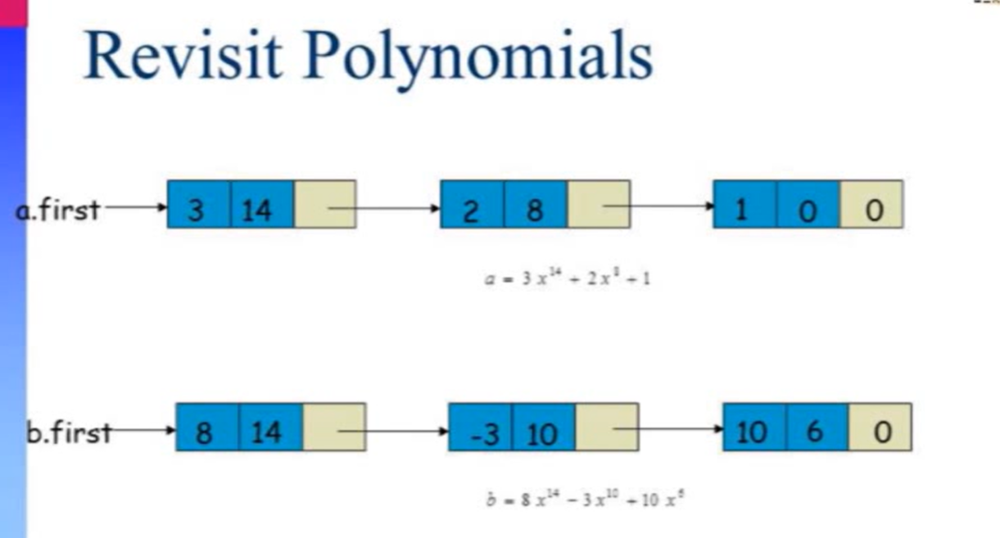

## node 回收
可以使用一個Linked list來記錄不需要使用的node的記憶體位置。
若需回收多項可以使用以下方法，先將要回收的List的最後一個node的next指向first，形成一個circle，再重新指定first
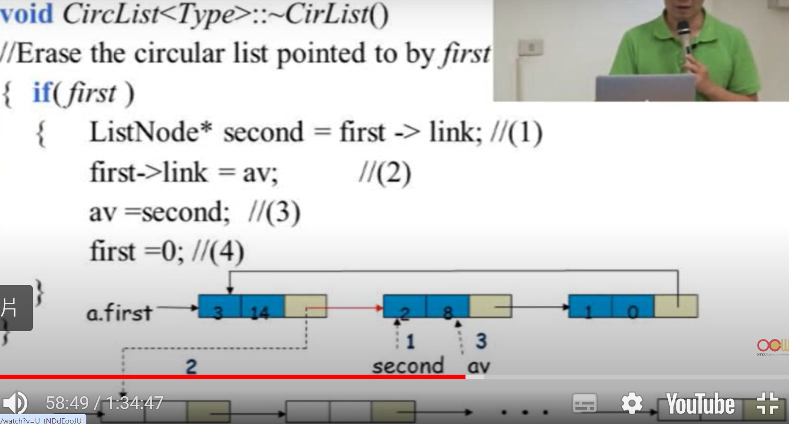

## equivalence relation
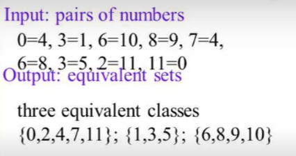

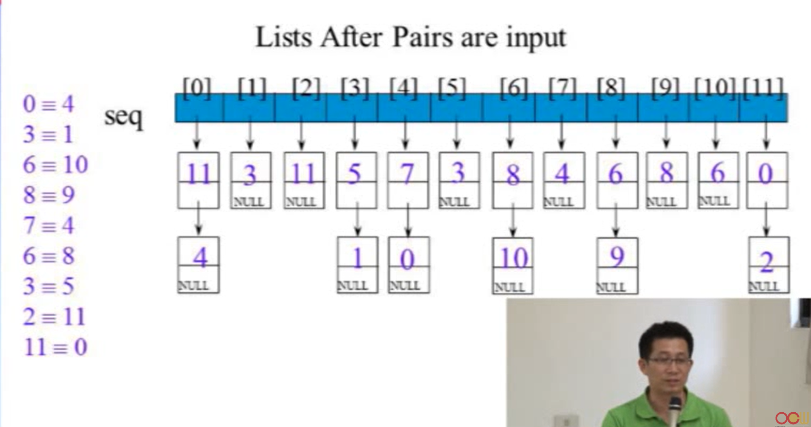

### code
1. 使用一個array來記錄所有可能的node
   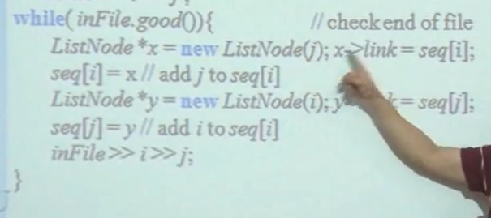
2. 使用list方式存取有關的node，如上圖
3. 建立完所有relation後，需要再用一個array來紀錄某個node是否已經被拜訪過
4. 從頭開始traverse array，每讀取一個後見檢查該node是否已經被拜訪過，若沒有則將該node加入stack，後續再從stack中取出拜訪。
   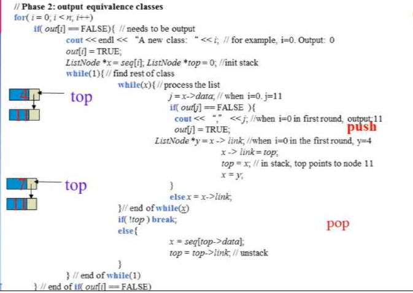

## doubly linked list
會有一個head node ，其left link指向left link最左邊的node，right link指向right link最右邊的node
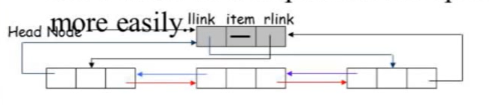
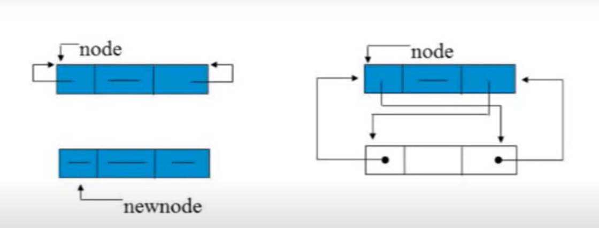
### insert
先指好新增的node，在改前後兩個node的指向
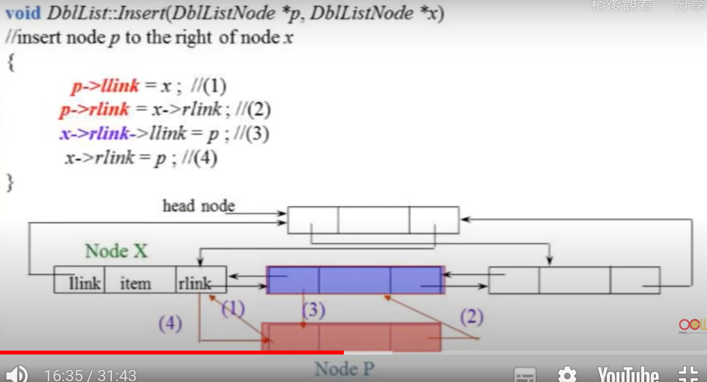
### delete

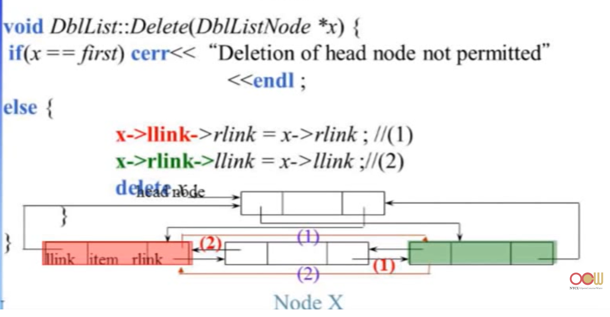

