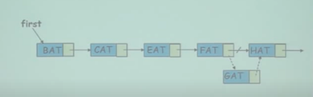

# List
## Insertion

重新assign FAT的next node 

## Deletion

1. 檢查是否為GAT
2. FAT的next node重新assign
缺點: 需要從頭開始找，使用array可以直接找到index，在搜尋上比較快
>由leetcode 發現技巧，使用兩個pointer，一個指向前一個node，一個指向當前node，這樣可以在O(1)時間內刪除node

## code

### Pinter 操作

1. x=y會將y所指的記憶體位置指給x，x所指的記憶體位置會被釋放。
2. *x=*y，將y所指的記憶體位置內的值指給x所指的記憶體位置。x和y所指的記憶體位置不會改變。但內容會是一樣的。

