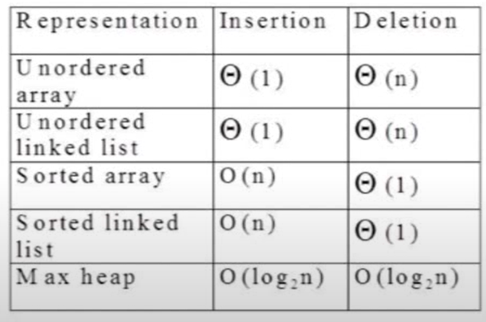
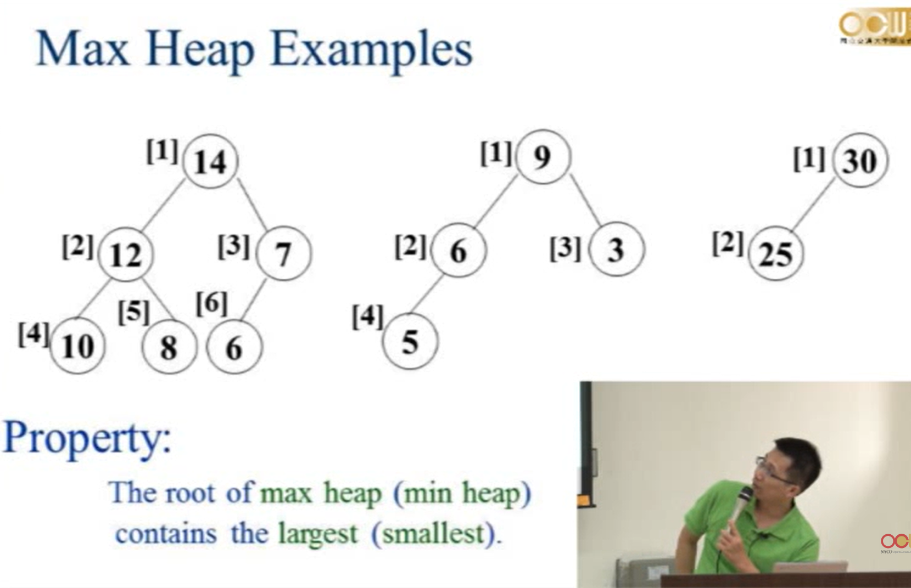
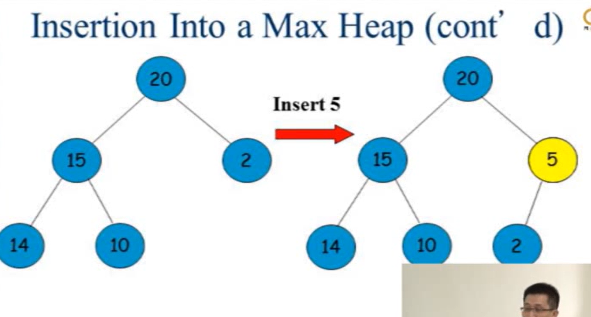
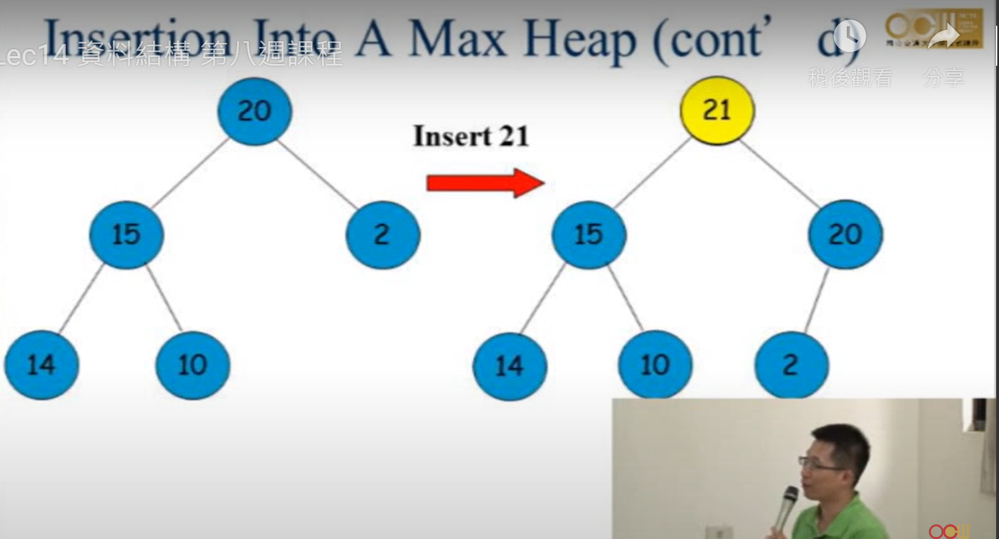
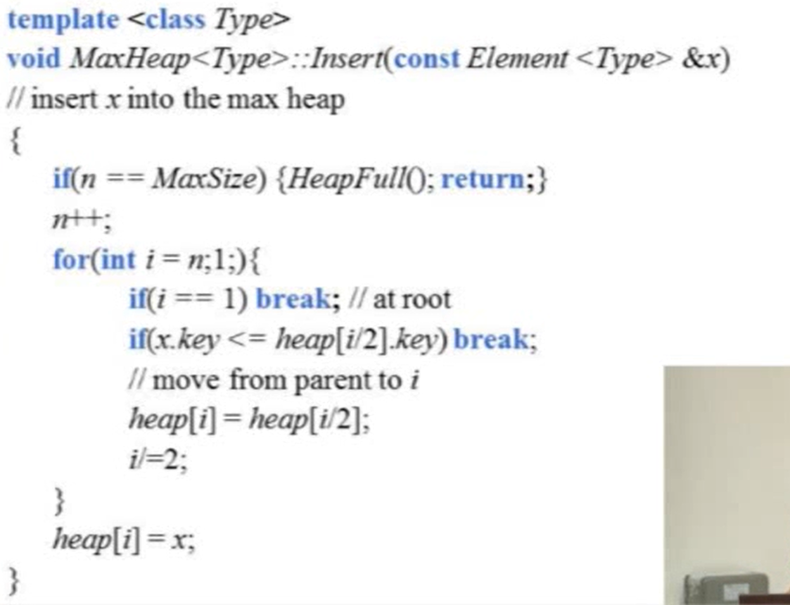
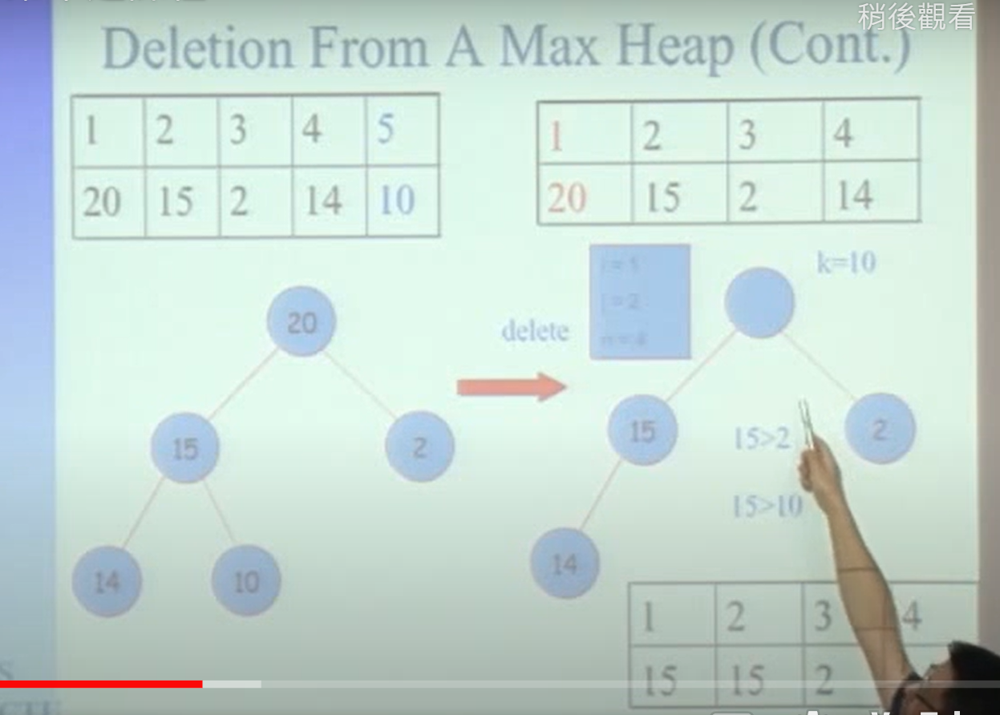
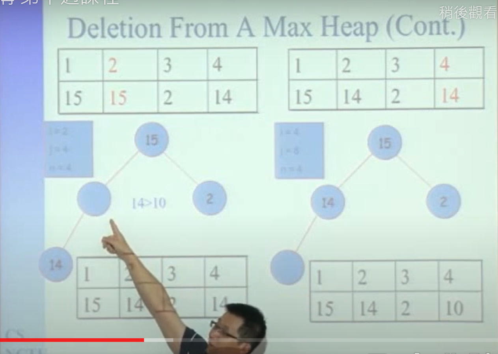
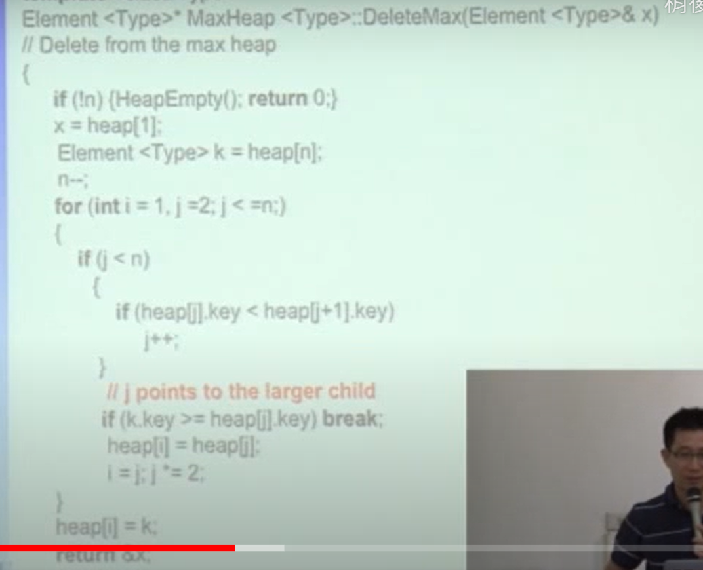

# Priority Queue &Heap
## 簡介
利用優先權來決定元素的順序，不是先進先出，優先權高的元素會先被取出。
## Heap與其他資料結構的比較

heap是complete binary tree，max heap的root是最大值，min heap的root是最小值。

## 範例
用array表示

## 操作

### Insert
buttom up
1. 將元素插入最後一個位置，符合complete binary tree的特性。
2. 與parent比較，若比parent大，則與parent交換，直到符合heap的特性。

用n當作array的index

> 如果使用tree node implement，如何實作?

### Delete
top down
1. 將root刪除，將最後一個元素放到root的位置。
   
2. 和children比較，找出比較大且大於自身的數值，交換位置。
   
3. 重複步驟2，直到符合heap的特性。

 

### sort
> 也可以用heap sort來排序，how?
1. 先將所有元素insert到heap中
2. 再一個一個delete，就可以得到排序後的結果。
> time complexity O(nlogn)，每個元素insert的時間複雜度為O(logn)，總共有n個元素。

