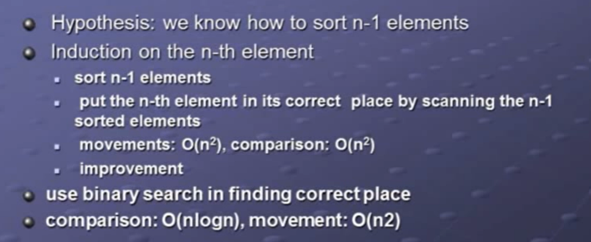
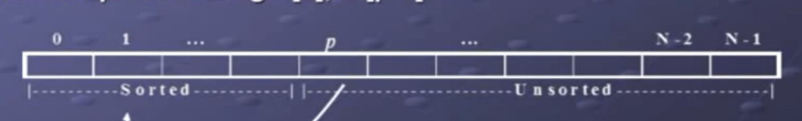
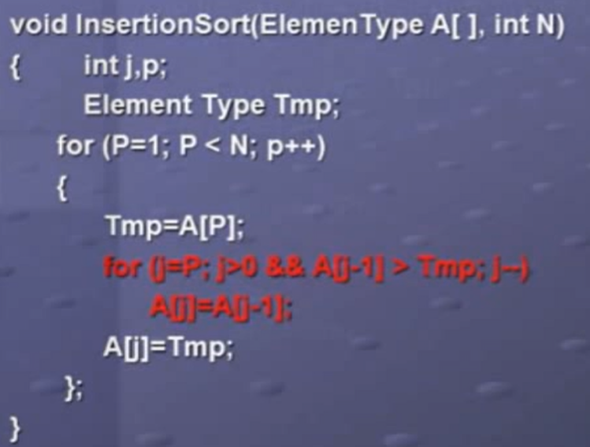
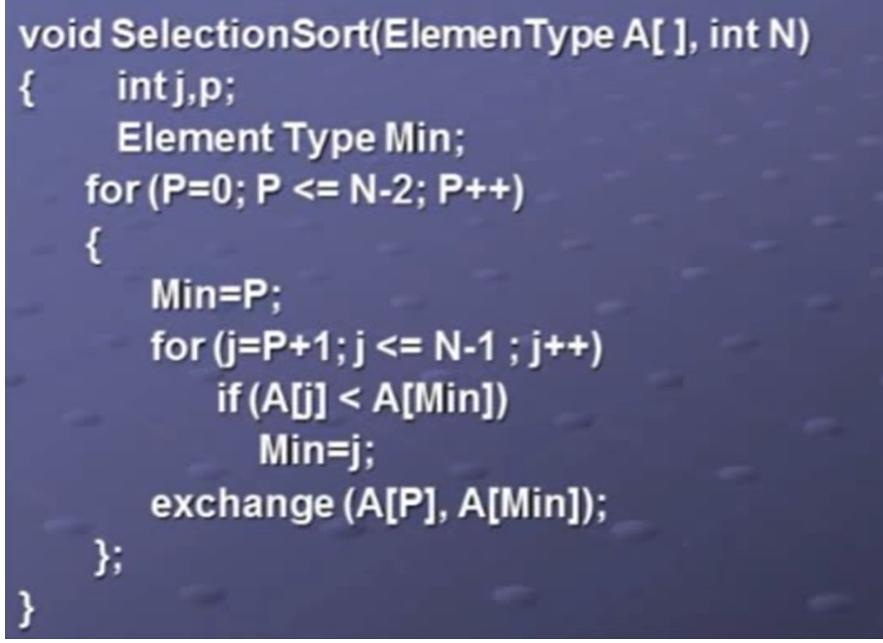
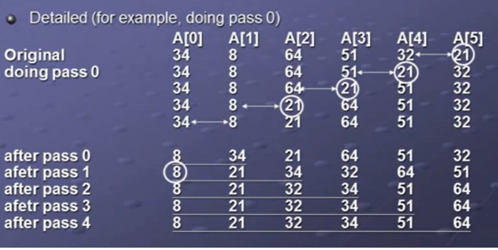
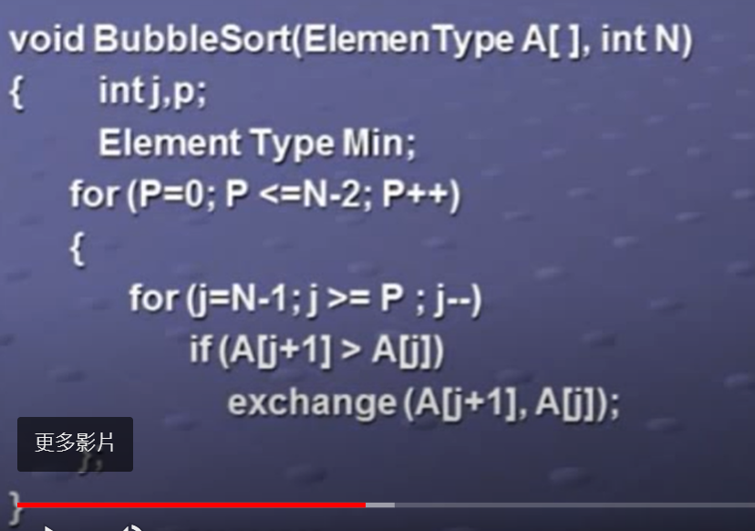

# sorting 
## 分類
### internal sorting
可同時將所有目標放置在記憶體中進行排序的演算法
### external sorting
當記憶體無法容納所有目標，需要分段排序的演算法
## 各種排序演算法
### insertion sort
在右方unsorted array中選取第一個元素，放入左方sorted array中的適當位置。
放入方法，由目標往前比較，若目標比前方小，swap，直到目標比前方大。
#### complexity
- time: O(n^2)
- space: O(1)

#### code

### selection sort
在右方unsorted array中選取最小的元素，放入左方sorted array的最後一個位置。
找到最小元素後，swap到sorted array的最後一個位置。
#### complexity
- time: O(n^2)
- space: O(1)
#### code

### bubble sort
從最後一個元素開始往前，兩兩比較，若前方比後方大，swap。

#### complexity
- time: O(n^2)
- space: O(1)
#### code

### merge sort

