# sorting 
## 分類
### internal sorting
可同時將所有目標放置在記憶體中進行排序的演算法
### external sorting
當記憶體無法容納所有目標，需要分段排序的演算法
## 各種排序演算法
### insertion sort
在右方unsorted array中選取第一個元素，放入左方sorted array中的適當位置。
放入方法，由目標往前比較，若目標比前方小，swap，直到目標比前方大。
#### complexity
- time: O(n^2)
- space: O(1)

#### code

### selection sort
在右方unsorted array中選取最小的元素，放入左方sorted array的最後一個位置。
找到最小元素後，swap到sorted array的最後一個位置。
#### complexity
- time: O(n^2)
- space: O(1)
#### code

### bubble sort
從最後一個元素開始往前，兩兩比較，若前方比後方大，swap。

#### complexity
- time: O(n^2)
#### code

### merge sort
將array分成兩半，分別排序，再合併。
會需要一個額外的array來存放排序後的結果。
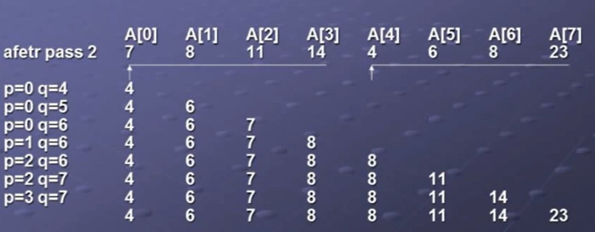
#### complexity
- time: O(nlogn)
#### code
recursive 呼叫function，
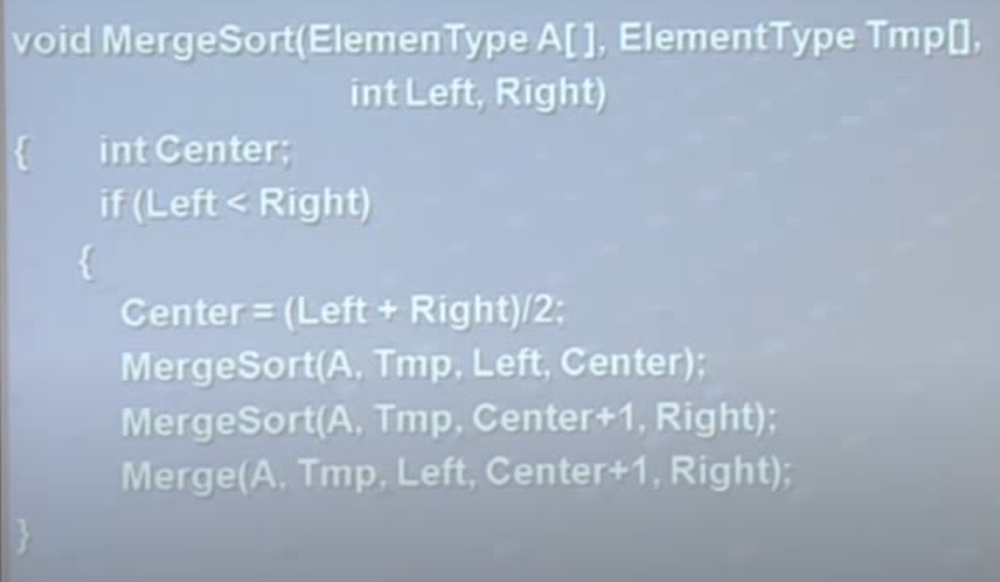
- 第一個while:兩兩比較，較小的放入tmp array
- 第二個while:將左邊剩餘的元素放入tmp array(在左方有剩餘的情況下)
- 第三個while:將右邊剩餘的元素放入tmp array(在右方有剩餘的情況下)
- 最後for loop:將tmp array的元素放回原array
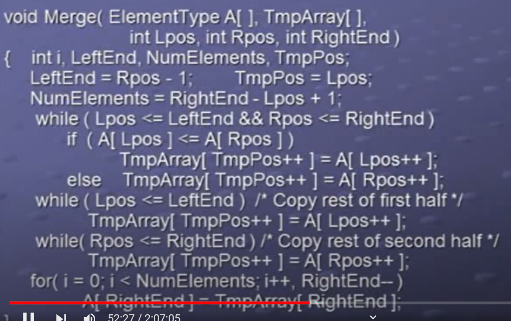
### quick sort
選取一個pivot，將array分成兩部分，左邊一堆比pivot小，右邊一堆比pivot大。
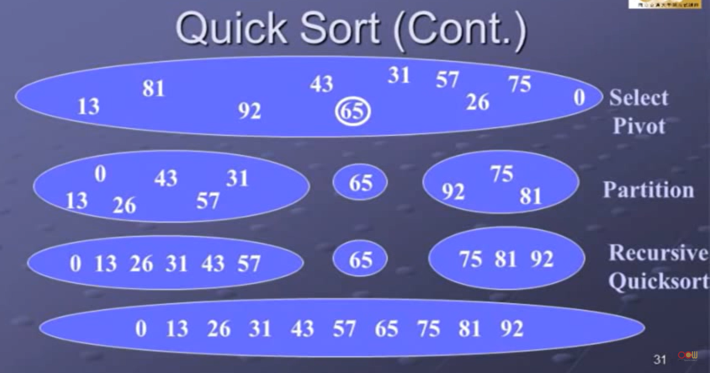
#### code
recursive 呼叫function，
選出pivot，將array分成兩部分，在分左右兩部分做recursive呼叫。
- 最外層do while loop，當left < right時，繼續做recursive呼叫。
- 內部第一個while loop，從左邊找到比pivot大的元素
- 內部第二個while loop，從右邊找到比pivot小的元素
- 交換上面兩個loop找到的元素
- 重複上面的步驟最後會將array分成兩部分，左邊一堆比pivot小，右邊一堆比pivot大，即可結束loop。
- 迴圈外call interChange()，最後將pivot(位置為left)與array[j]交換位置，即可將provit放到正確的位置。
#### complexity
- average case time: O(nlogn)
- worst case time : O(n^2)
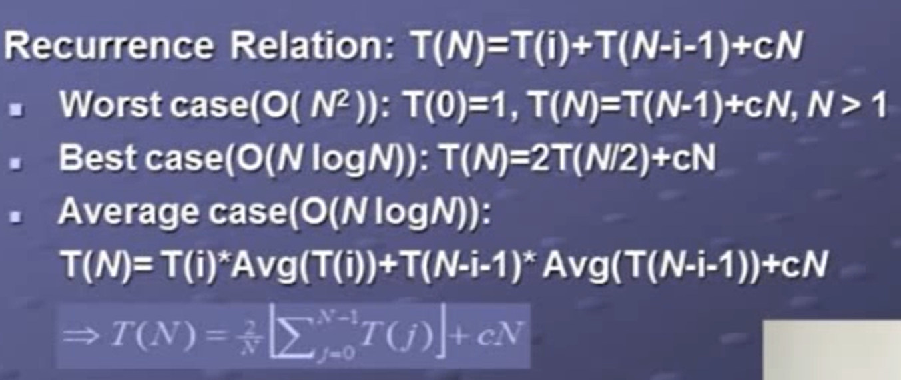
適合用於大量資料的排序，若資料量小，insertion sort可能比較快。
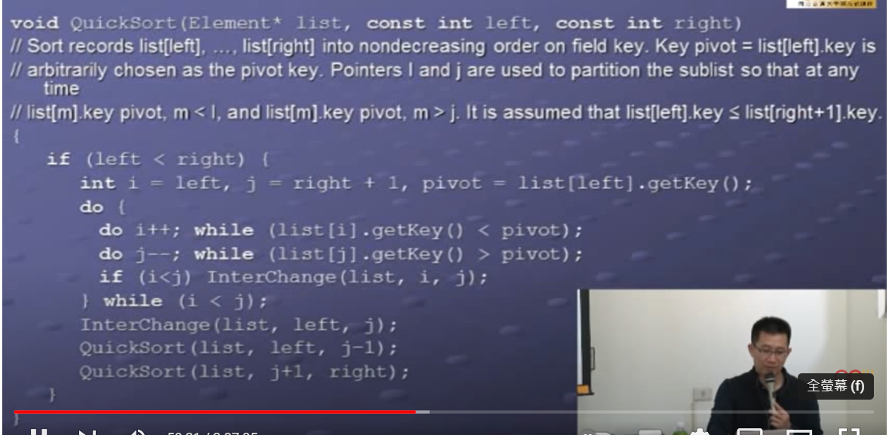
## general lower bound of comparison-based sorting
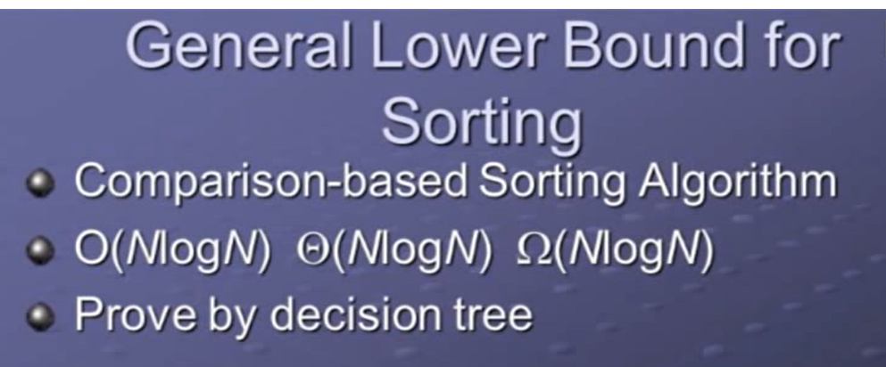

### heap sort
使用min heap或max heap來排序，逐個delete root，即可得到排序後的array。
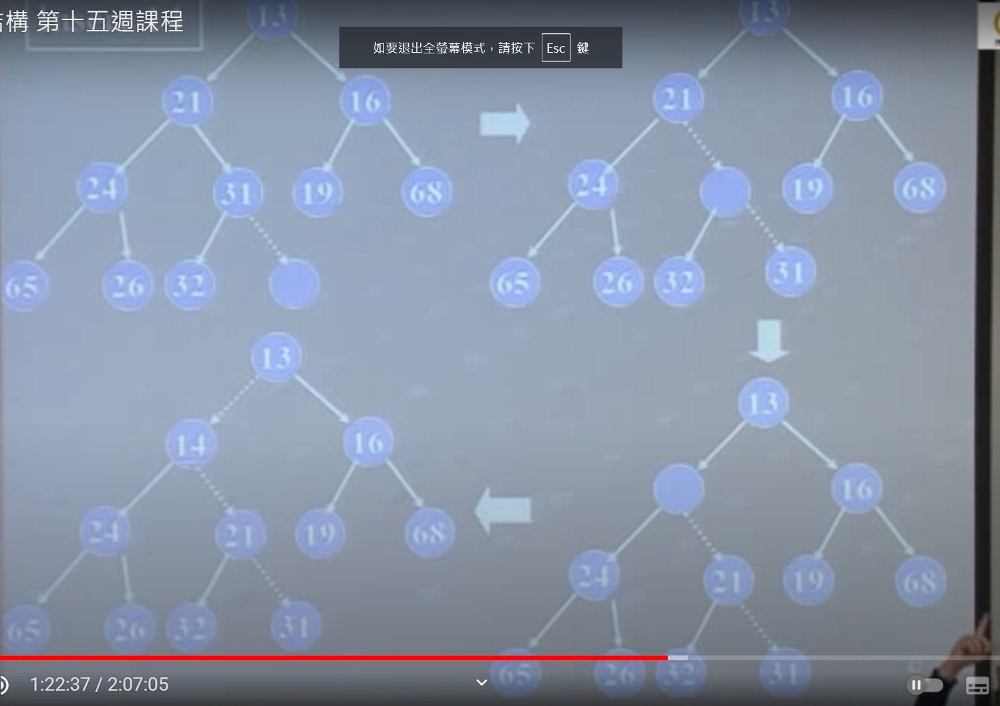

使用max heap時，不需要用到額外的array，將delete root的元素放到array的最後一個位置即可。
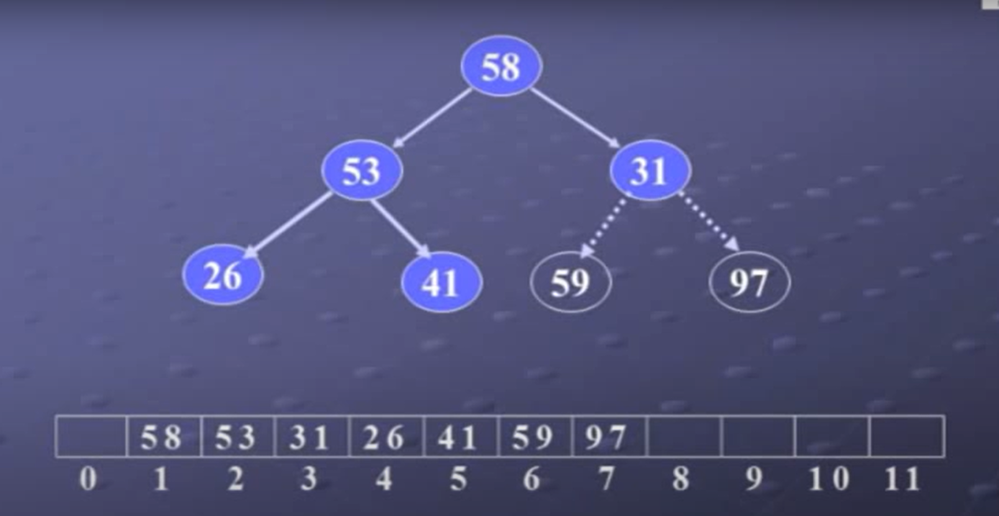
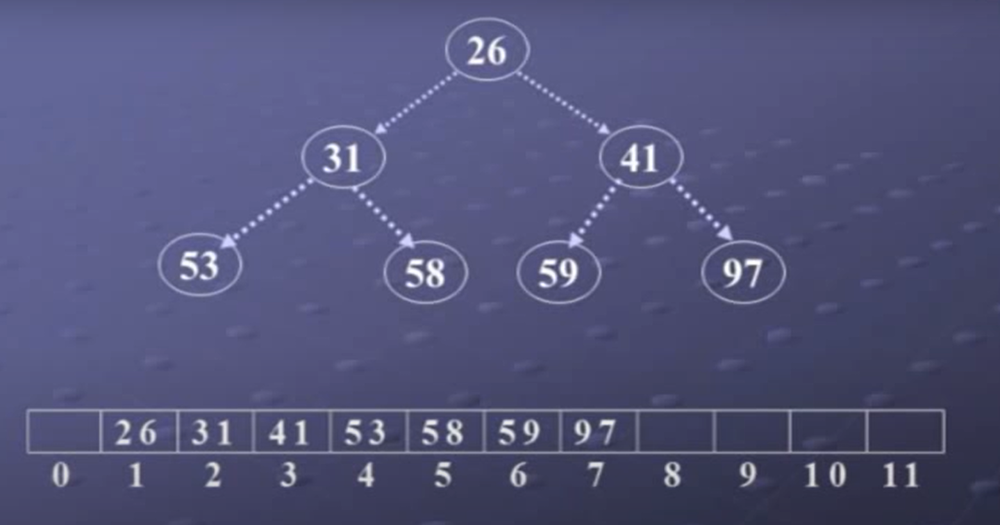

#### complexity
- time: O(logn)

#### build heap
##### top-down
##### bottom-up
1. 先隨便塞進array
    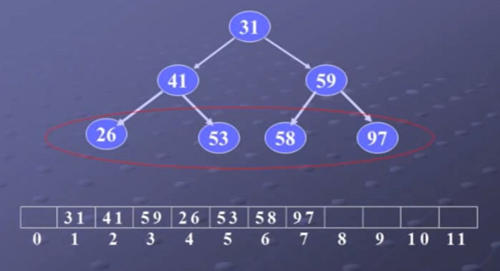
2. 從最後一個有child的node開始，看子數哪個最大，和parent比較，若子數比parent大，swap。
   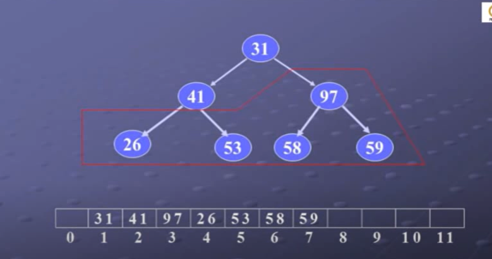
3. 重複上面的步驟，逐個滿足heap，直到root。
   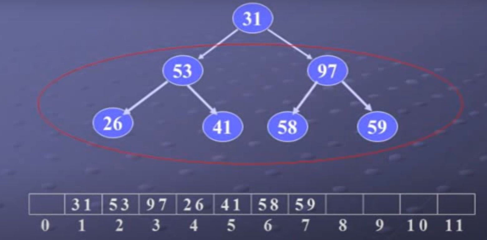

### bucket sort

#### redix-exchange sort
根據最重要的位置分堆(最高位數)
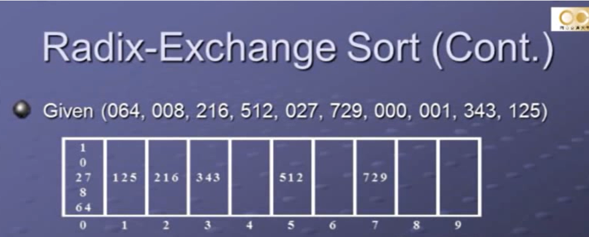

#### straight radix sort
從最不重要的位置分堆，(個位數)
每個bucket使用queue來存放元素。(first in first out)
1. 先從各位數分堆，得到排序後的序列，
2. 再用序列，從十位數分堆，直到最高位數。
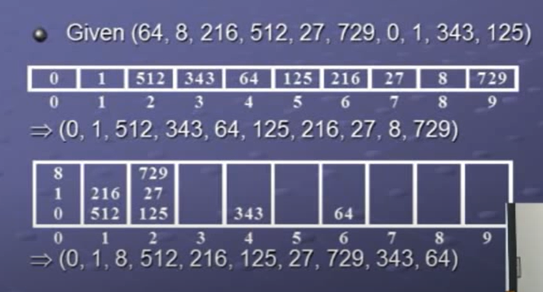
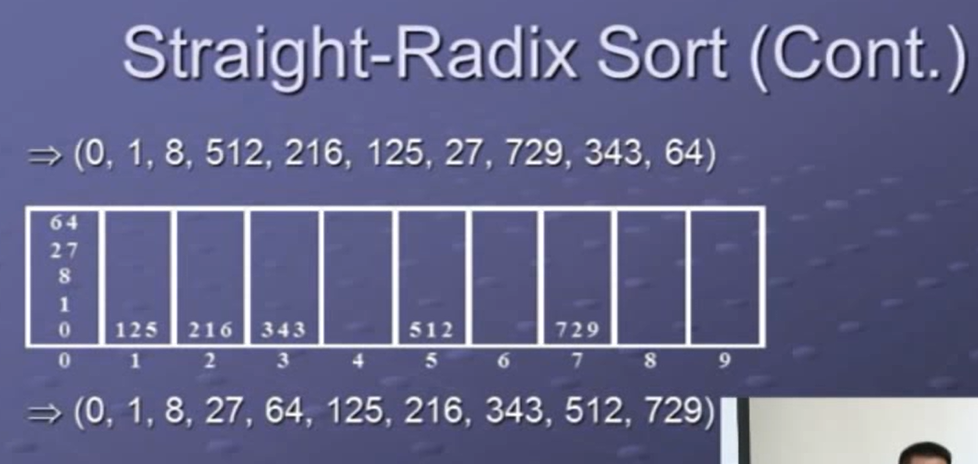

### external sorting
- 利用merge sort排序概念。
條件:記憶體只能放750個record，但有4500個record需要排序。
- 分為3個block，每個block放250個record。
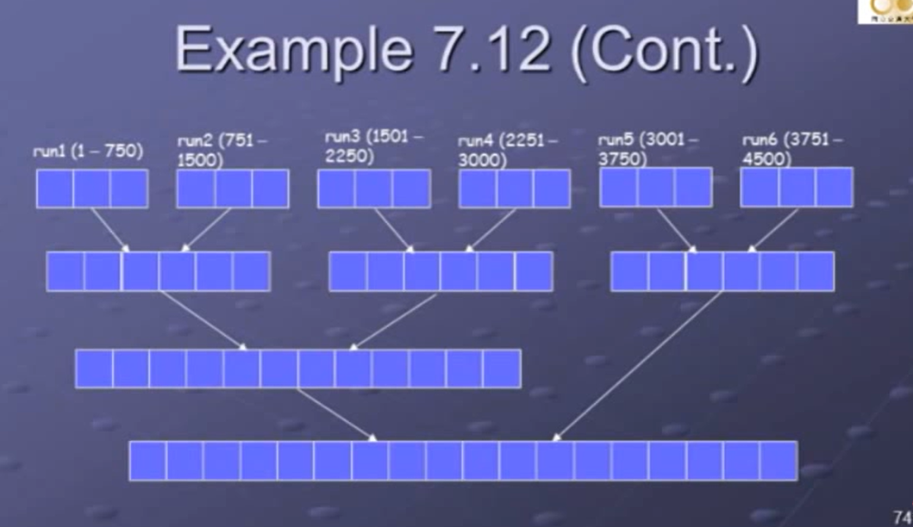

#### external sorting merge path
先從最小block開始merge，避免越大的block merge太多次。
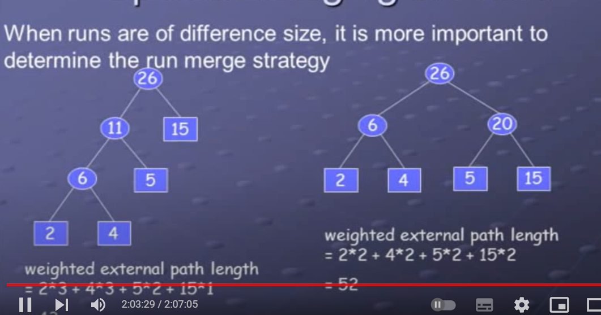

