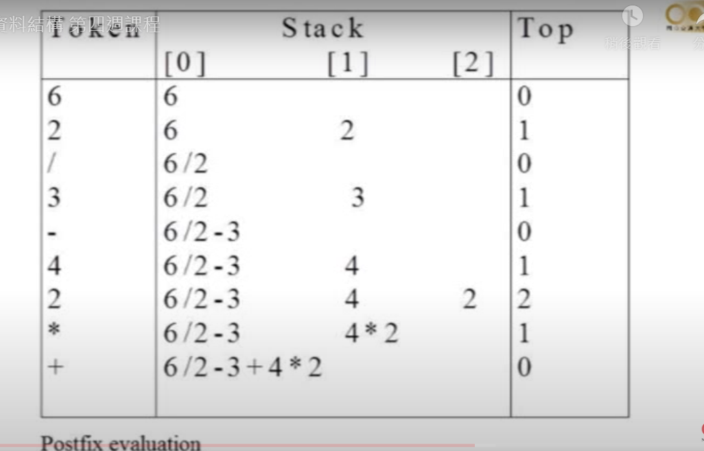

# Stack

## Introduction
FILO
## Implementation

### add

### delete

# Queue

## Introduction
FIFO
## Implementation

### add

### delete

#### 問題:
依照上述方式，queue判斷是否為full的方法是檢查rear是否等於size-1
這樣在queue滿了後的下一次delete，因為最後一個資料沒有被搬移，還不是空的，仍會被認為是full。

##### 解法
用取餘數的方式，front = (front+1)%size, rear = (rear+1)%size，判斷是否為full的方法是檢查front+1取餘數是否等於rear

但:
**這樣會浪費一個空間**，因為若front==rear，則無法判斷是full還是empty。

# Stack&Queue 應用
## path搜尋
用stack來記錄走過的路徑，當遇到死路時，將stack pop，回到上一個點，再往其他方向走。

### code
mark為走過的路徑array，0為未走過，1為走過
maze為地圖array

## evaluation of expression
- infix: 3+5*8-6
- postfix: 358*+6-

### postfix to infix
### step
1. 若遇到數字，push進stack
2. 若遇到運算子，pop兩個數字，進行運算，再push進stack

#### code

### infix to postfix
#### priority
數字越小，優先權越高

#### step
1. 遇到數字，直接輸出
2. 遇到運算子，push進stack
3. 運算子比較，stack中的運算子優先權**高或等於**即將輸入的運算子，則把stack中的運算子pop出來，直到stack中的運算子優先權低於即將輸入的運算子，再push進stack，再psuh即將輸入的運算子
4. 遇到左括號，push進stack
5. 遇到右括號，連續pop出stack中的運算子，直到遇到左括號

#### code

