# Huffman Code
## 大意
依照字元出現頻率，將字元編碼成不等長度的二進位字串，使得編碼後的字串長度最短。
## 步驟圖
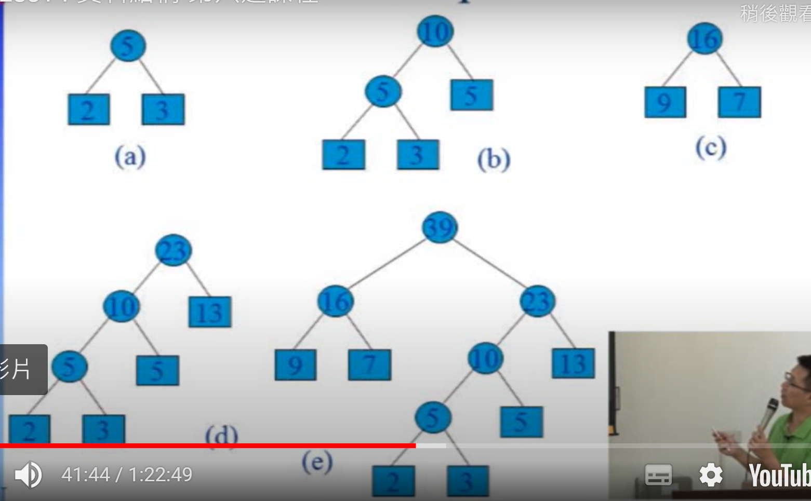
從頻率最小的節點開始建立樹，每次從頻率最小的兩個節點，做merge，直到所有節點都merge完畢。

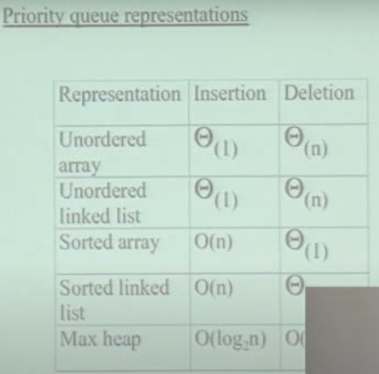

先對所有字母做統計，再建立huffman tree，使用Heap方式建立，minium tree 。(參考queue中的priority queue)   
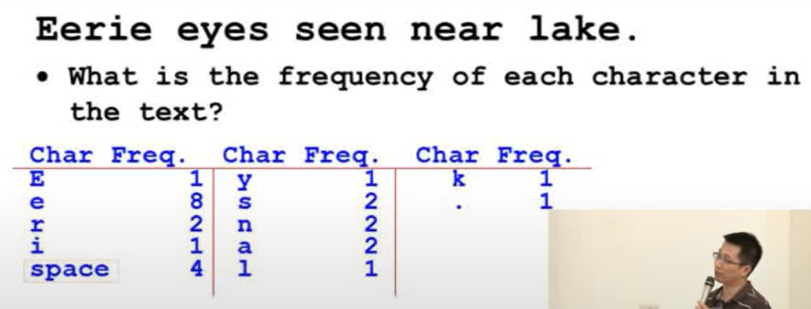

有一個array 實現heap(priority queue)，內容會依照頻率排序
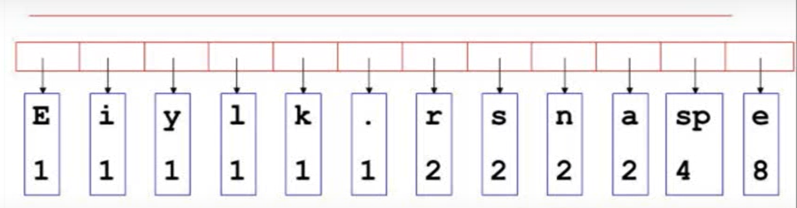

每次取出最小的兩個節點，做merge。
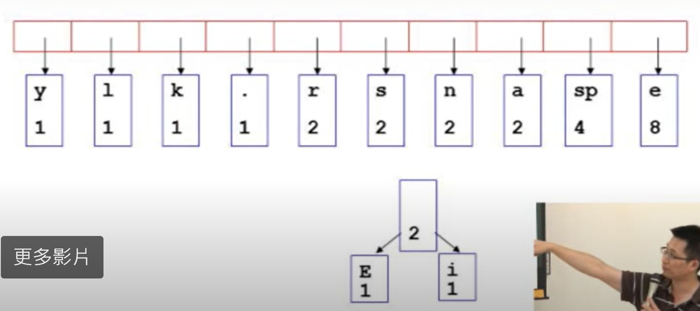

放回Heap中
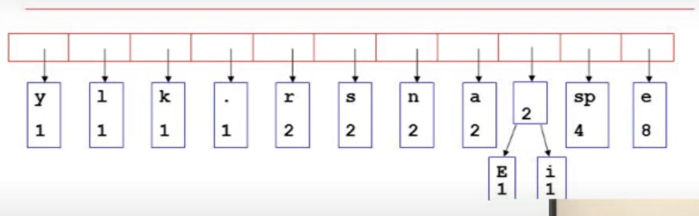
重複以上步驟
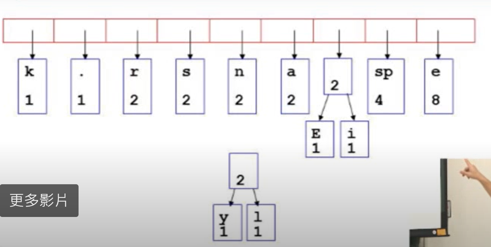
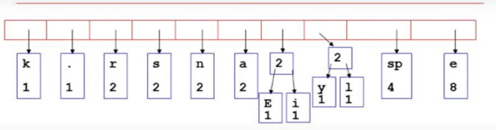
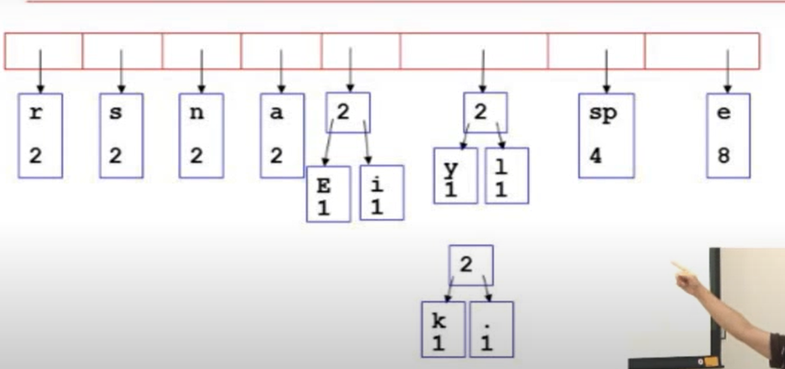
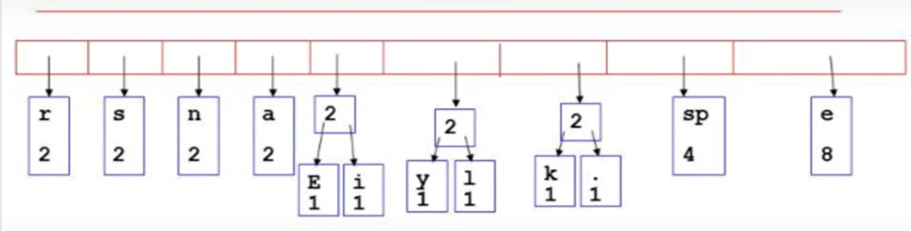
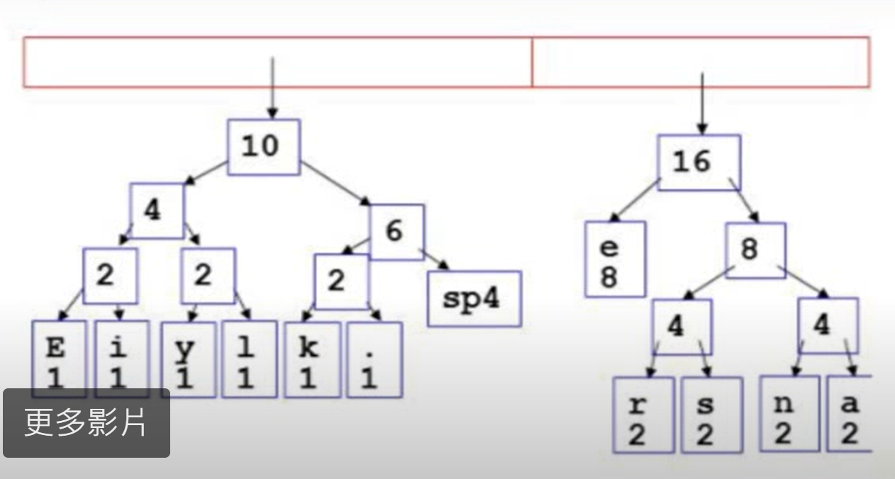

做到heap中只剩下一個節點
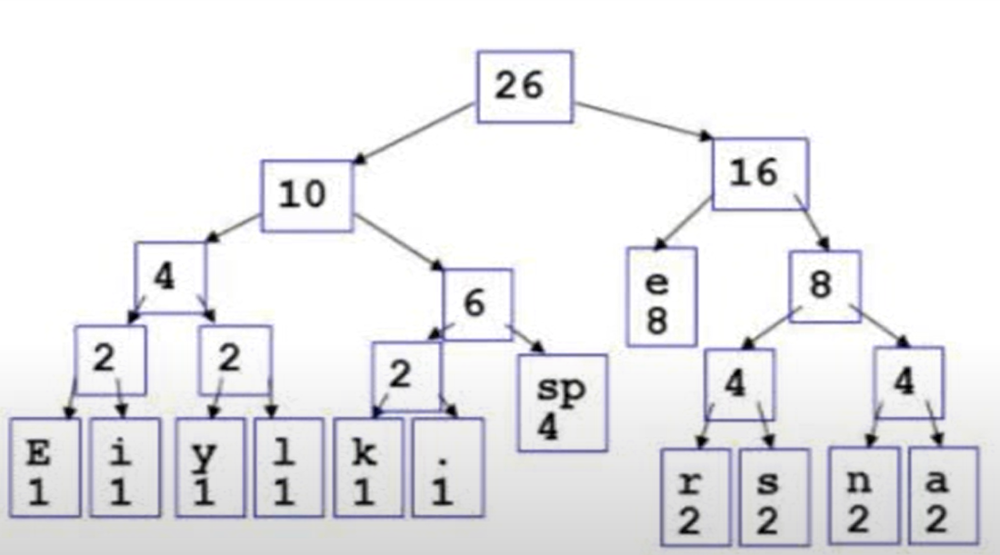

完成後編碼
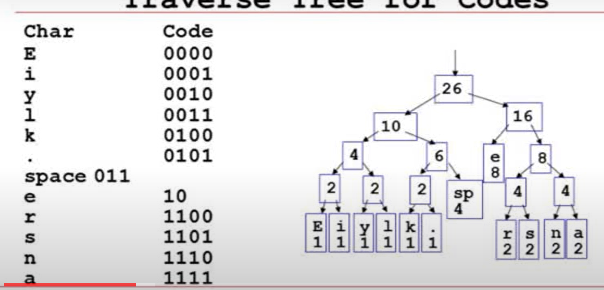
> Q:huffman code是否唯一?
>
> A:不唯一，建Heap時遇到頻率相同的字母排列不一定一樣，編碼就會一樣。
