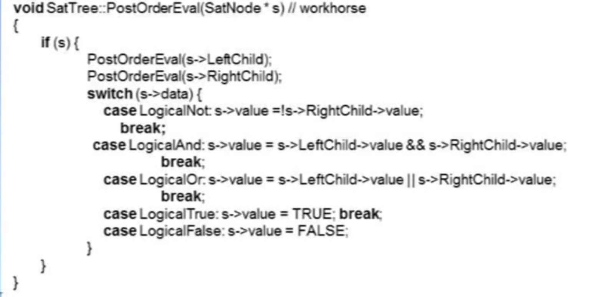

# Tree

## DEFINITION
a collection of nodes

depth:深度

height:高度

degree:pointer個數(point out)

tree也是一種graph

parient:父節點

siblings:同一層的節點

## representation of tree

### list

### k-ary tree

缺點:空間使用過多

### left child-right sibling

紀錄左子節點和右兄弟節點，簡化空間使用

## binary tree
> binary tree 和 binary search tree 差別?
### binary tree特性:
1. 第i level的node數量為2^(i-1)

2. 最大node總數為(2^k)- 1

### binary tree 節點與邊數關係計算

1. n0 = n2 + 1，n0為degree=0的node數量，n2為degree=2的node數量
2. 總節點數 n=n0+n1+n2
3. 總branch數 B+1=n
4. B=n1+2n2
5. 總節點數 = n1+2n2+1
6. n0=n2+1
>n=n0+n1+n2，B+1=n，B=n1+2n2=>n1+2n2+1=n
>n1+2n2+1=n0+n1+n2=>n0=n2+1

### comparison of binary tree and tree

### full binary tree
每個node都有2個children，除了leaf node，擁有最大量的node，塞滿的意思

### complete binary tree
沒有全滿，但是從左到右塞滿
## 程式實作binary tree
### array

i為該node在array中的index

左子節點:2i

右子節點:2i+1

parent:i/2

優點:快速找到parent和child

缺點:空間使用過多

### linked

優點:節省空間

缺點:找parent較慢

### compare array and linked

## binary tree traversal
1. LVR:inorder
2. VLR:preorder
3. LRV:postorder
4. level order

### 實作方式:
1. recursive
2. inorder,preorder,postorder:stack
3. level order:queue

## 應用
### 計算多項式

### copy tree
用**preorder traversal**，先建立新的節點，再往下找

### tree comparison

> Q : 可否使用inorder ,postorder 做tree copy?
> 
> A : 不行，因為inorder和postorder在copy之前會先往下找，沒有先建立新的節點，這樣樹建不起來。

> 給一個inorder string ，是否可以建立唯一的binary tree?
> 不能

### calculus expression

如何讓電腦可以判斷calculus expression?
1. 使用stack，將運算子放入stack，遇到運算元就pop出來(postfix notation)
2. 使用tree，將tree轉換成postorder

> Q : **如何將calculus expression轉換成tree?**
> 
> A : ??

tree中必須包含，left child , right child , value , data 

方式:

有n個變數，2^n種可能，將2^n種組合放入tree中嘗試，

postorder步驟:
1. 左子樹
2. 右子樹
3. 以下幾種情況:
   1. 遇到not
        > 將右子樹做not，結果丟到value。
   2. 遇到and
        > 將左子樹value和右子樹value做and，結果丟到value。
   3. 遇到or
        > 將左子樹value和右子樹value做or，結果丟到value。
   4. 遇到true
   5. 遇到false

## thread binary tree
leaf node的left child and right child會被浪費，利用這些空間，將leaf node的left child指向前一個節點，right child指向下一個節點。

### 新增欄位
新增:leftThread, rightThread ，做boolean標記，判斷是否為thread
 

### inorder traversal作法
> how??

### 缺點
沒啥用
insert,delete,search都很麻煩

## binary search tree
特質:左子樹的值都比root小，右子樹的值都比root大
### search
1. 從root開始
2. 若比root小，往左走
3. 若比root大，往右走
4. 直到找到或是null

### the k th largest element
找出第k大的元素，意即由小到大排序，第k個元素。
#### 實現方式
在node中新增一個欄位紀錄leftsize，紀錄左子樹的大小+1(自己)的大小。

#### 步驟
1. 和當下node比較，若相等，回傳
2. 若k小於node.leftsize，並往左走
3. 若k大於node.leftsize，k減node.leftsize，並往右走
> 怎麼決定leftsize?
### Insert

### delete
簡單情況，只有一個child，直接刪除，child取代

複雜情況，有兩個child，找到左子樹的最大值(右子樹最小值也可)，取代

### winner tree
> 為何要有winner tree ，當數字量極大，無法同時在memory，但需要排序時，winner tree可以幫助我們快速找到最大值。

### loser tree

### forest

### set

#### union
哪一方底下的node越多，就當作root，另一方歸順。

#### 表示為array

> 使用array表示與pointer表示的優缺點為何
#### collapsing
根據quesy頻繁程度對tree做調整，調至距離root較近的地方。

### inorder preorder posprder
#### 給定inorder順序，所建構tree不唯一
#### 給定inorder preorder順序，所建構tree是唯一

